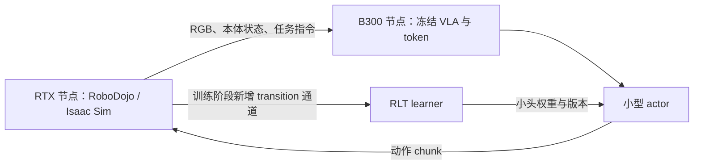

# 从 RLinf RLT 到 Physical Token：RoboTwin 2.0、RoboDojo 集成与实验教程

用这份教程保留你现有的 RLT baseline，在 ManiSkill 上快速筛选算法，再接入两个官方仓库最新 main 的在线训练与评测：RoboTwin 2.0 和 RoboDojo。优先验证 physical token；把严格流式 RL 作为独立研究变量。

核查日期：2026-09-07。RLinf HEAD：`68feab9f0a50764d75e42f12f837dbbb74775d15`，同时核对了当前工作区未提交配置。本文是中文研究教程，不属于 `source-en/source-zh` 的正式 Sphinx 页面。**集成设计、待创建配置及算法实验均未实现或实测**；不要把示意代码当成当前已支持的功能。

已有笔记：[ManiSkill 本机入门](rlt_maniskill_local_getting_started_zh.md)、[WAM 与 physical token 可行性](wam_rlt_physical_token_feasibility_zh.md)。本篇集中解决环境迁移、轻量在线更新和论文实验；不要求你同时换成 WAM。

阅读顺序：环境选择看第 1–2 节；baseline 和迁移接口看第 3–4 节；RoboTwin 操作看第 5 节；RoboDojo 操作看第 6–7 节；算法与文献看第 8–10 节；实验排期和验收看第 11–13 节。

## 0. “最新版本”的范围与快照

按你的要求，环境目标是以下两个官方仓库的 **最新默认分支 main**，不是 RLinf 的历史适配分支，也不是 RoboTwin 的 IsaacLab-Arena 分支。本次通过 GitHub API 核查到：

| 官方仓库 | 默认分支 | 最新 commit（核查时） | 提交时间 UTC |
|---|---|---|---|
| [RoboTwin](https://github.com/RoboTwin-Platform/RoboTwin) | main | `96c1feab536306b50c26af200044fcdf126e8904` | 2026-09-05 08:06:21 |
| [RoboDojo](https://github.com/robodojo-benchmark/RoboDojo) | main | `ee67a1468510da7624a089164402359f2afc72c8` | 2026-08-31 07:36:42 |

“使用最新版”与“论文可复现”可以同时满足：开始一个新实验批次时获取 main 最新版，记录 SHA 后冻结本批次；上游更新后先跑契约测试，再开新批次，不在同一消融表中混合版本。

| 子模块 | RoboTwin main 固定版本 | RoboDojo main 固定版本 |
|---|---|---|
| XPolicyLab | `c37109c500be67d0dea6b36bf7337bbd26e763cd` | `432f82b1758c5b1202e42a3dfe014546dbc50871` |
| IsaacLab | 不使用该子模块 | `afca7b09d60d8beb9c1cb28b43066499940b969b` |
| cuRobo | 安装脚本选择 v0.7.8 | `d17b54ce32cba095c0b000c4c58777075d11de0e` |

本次还读取了 XPolicyLab 独立 main `eb0f959c4926c0178d48b8ada5ef05f693beb802` 作为接口参考，并比对两个 benchmark 固定版本的 demo adapter 签名。独立 main 不等于 benchmark 已验证的组合；首次采用各 benchmark 子模块 pin，升级后重新测跨端协议。最新 RoboTwin 的安装脚本会主动更新 XPolicyLab，具体处理见第 5.2 节。

## 1. 先确定研究路线

### 1.1 推荐的先后顺序

| 阶段 | 做什么 | 为什么现在做 | 完成标志 |
|---|---|---|---|
| A | ManiSkill：复现现有 RLT AC，保留 TD3 对照 | 已有代码、示范、Stage 1 和本机环境 | 能证明实际执行了 Stage 2 actor，得到固定 seeds 的评估结果 |
| B | 同一 ManiSkill 任务：RLT token 与 physical token 对比 | 避免同时改变机器人、数据和算法 | 同等训练预算下，表示 probe 和在线 RL 指标可重复 |
| C | RoboTwin 2.0 最新 main：新 backend 接到 RLT | 可复用 RLinf 上层，但旧 VectorEnv 与 main 不兼容 | 官方任务 → 新环境桥接 → replay → learner → actor 闭环 |
| D | RoboDojo：先接 XPolicyLab 官方评测 | 符合你偏好的论文平台，先验证数据和策略接口 | 在 RTX 仿真机完成一个任务的官方评测 |
| E | RoboDojo：开发训练用环境 adapter | 官方当前发布定位是 eval-only | 单环境、短 chunk、正确 reset/reward/terminal，再扩大并行 |
| F | 固定表示后逐步减少 replay，验证严格 streaming | 将表示收益与优化器/调度收益分开 | 新数据到更新的时延和学习稳定性均有证据 |

这里的“迁移算法”是复用方法和训练代码；**不是把 Panda peg-insertion 的 Stage 2 权重直接部署到双臂机器人**。机器人、任务、相机和动作语义变化后，至少需要匹配的新示范/参考策略、归一化统计和 Stage 2 训练。

### 1.2 图片中的想法怎样变成可检验问题

你们的主线可以表述为：**给 VLA 的 RL 状态瓶颈加入与接触、几何和动作后果有关的监督，使小型 actor–critic 在有限交互下更容易学会精细操作与动力学适应。**

建议拆成三个问题：

1. **表示问题**：相同维度的 token，加入物理监督后是否更能预测接触与状态变化，并提升 RL 样本效率？
2. **优化问题**：在冻结表示后，是否可以减少 replay，甚至仅使用最新 transition 更新，而保持可接受的成功率？
3. **系统问题**：端侧究竟执行哪些计算？只训练小头是否真的满足控制时延、内存和通信预算？

这些是研究假设。给 token 取名 physical token、加入辅助损失、或者将已有流式优化器用于 RLT，都不能单独保证创新性。

## 2. B300 能不能部署 RoboDojo

### 2.1 明确结论：不要规划纯 B300 的官方 RGB 仿真方案

**B300 可承担策略训练/推理，但纯 B300 节点不应作为 RoboDojo 官方 Isaac Sim RGB 仿真的受支持部署目标。建议 RTX 仿真机 + B300 模型机。**

依据分三层：

- RoboDojo 当前安装脚本固定 Isaac Sim **5.1.0**，原生环境为 Python 3.11；它并非一个独立于 Isaac Sim 的轻量渲染器。[安装源码](https://github.com/RoboDojo-Benchmark/RoboDojo/blob/ee67a1468510da7624a089164402359f2afc72c8/scripts/install.sh)
- NVIDIA 的 Isaac Sim 5.1 要求页明确排除没有 RT Core 的 GPU。[NVIDIA 要求](https://docs.isaacsim.omniverse.nvidia.com/5.1.0/installation/requirements.html)
- AWS 的 Isaac Lab 部署指南直接把 B200/B300/GB200 列在不支持该 RTX 渲染工作负载的一组中；这是云平台的一手部署说明，不是本机实测。[AWS 兼容表](https://aws.amazon.com/blogs/machine-learning/scale-robot-reinforcement-learning-with-nvidia-isaac-lab-on-amazon-sagemaker-ai/)

不要把“Blackwell”理解成所有卡都具有相同图形能力：B300 与 RTX PRO 6000 Blackwell 是不同定位。`headless` 只是不显示窗口；VLA 使用 RGB，相机仍需要渲染。关闭相机改成低维状态任务，无法构成官方视觉 benchmark 的等价对比。

2026-09-08 已重新核对本机：8×`NVIDIA B300 SXM6 AC`、驱动 590.48.01、每卡 275040 MiB、compute capability 10.3，NVIDIA Vulkan ICD 文件存在；但系统没有 `vulkaninfo`，且本文没有在 B300 上安装/启动 RoboDojo 的 Isaac Sim 5.1，因此不能把“RoboDojo 在 B300 上技术上绝对无法启动”当作本机实验证据。严格结论应是：**RoboDojo 官方要求 RTX/RT Core 路径，B300 不是该 benchmark 文档承诺支持的部署目标；即使某版 Omniverse renderer 能枚举 B300，也属于需要自行验证且无等价支持保证的组合。** 驱动版本、CUDA compute 支持和 RT 渲染支持是三件事。

### 2.2 推荐拓扑



官方 XPolicyLab server/client 可解决**分机评测**；图中的 transition 通道和 learner 联动是本文提出的训练扩展，需要开发。仅能远程调用策略不代表已经能远程在线 RL。

| 资源条件 | 建议 |
|---|---|
| 暂时只有 B300 | 在现有 ManiSkill 栈迭代；离线准备 RoboDojo 数据、模型 adapter 和 CPU 契约测试 |
| 有一台符合 Isaac Sim 5.1 要求的 RTX 机器 | 先单任务单环境评测；再测相机数、场景复杂度、并行数和显存 |
| B300 + RTX 跨机器 | 优先官方 server/client；进入 RL 后选择 RPC 环境代理或 RLinf 异构 worker |
| 要做真正端侧论文 | 另测目标端侧硬件；B300 上的小头速度不能代表端侧端到端速度 |

RoboTwin main 基于 SAPIEN，不能照搬 Isaac Sim 的兼容结论。其当前 requirements 固定 `sapien==3.0.0b1`、`torch==2.4.1`；RLinf 旧适配安装分支则使用 SAPIEN 3.0.1，并包含面向新 CUDA 的扩展架构设置。两者不能混称同一栈。当前机器经过 CUDA 13/扩展兼容处理后，已在 B300 上完成 RoboTwin main 的 reset、三路 RGB、官方 expert episode 和 bridge 20 步动作执行；这证明本机的 **RoboTwin main** 路径可用，不推导出 **RoboDojo/Isaac Sim** 同样可用。[RoboTwin 安装](https://robotwin-platform.github.io/doc/usage/robotwin-install.html)、[已知问题](https://robotwin-platform.github.io/doc/common-issue/index.html)

## 3. 先理解当前 RLT baseline

### 3.1 两阶段路径

```text
Stage 1：目标任务示范
    → OpenPI / π0.5 的 VLA SFT + token 重建
    → 保存匹配的 VLA、token module、模型配置与归一化统计

Stage 2：RGB + proprio + language
    → 冻结的 Stage 1 模型
    → z_rl、proprio、ref_chunk
    → 小型 actor 输出动作，critic 学 Q
    → 环境交互与 replay
    → 更新小头并同步 rollout
```

论文的基本方法见 [RL Token](https://arxiv.org/abs/2604.23073)。以下细节以你的源码为准：

| 位置 | 已核实行为 | 改进时的用途 |
|---|---|---|
| [Stage 1 配置](../../examples/sft/config/maniskill_rlt_stage1_sft_openpi_pi05.yaml) | `openpi_rlinf`、`use_rlt=True`、两路图像、8 维动作 | 新 benchmark 的 Stage 1 起点 |
| [SFT 模型](../../rlinf/models/embodiment/openpi_rlinf/sft_action_model.py) | `loss = rlt_loss + rlt_alpha * vla_loss` | 加辅助监督时别把 `rlt_alpha` 误当 token loss 系数 |
| [Token Transformer](../../rlinf/models/embodiment/modules/rlt_token_transformer.py) | token 编解码 | physical token 的主要表示接入位置 |
| [特征抽取](../../rlinf/models/embodiment/openpi_rlinf/eval_action_model.py) | `extract_rlt_obs()` 返回 `z_rl/proprio/ref_chunk`，在 `no_grad` 下执行 | 第一版保持该接口不变 |
| [小型策略](../../rlinf/models/embodiment/mlp_policy/rlt_mlp_policy.py) | actor 输入 reference + token + proprio；critic 状态输入 token + proprio | 当前不是直接优化 VLA flow likelihood |
| [AC worker](../../rlinf/workers/actor/fsdp_rlt_ac_policy_worker.py) | Q 项 + BC 项，固定零熵权重；默认使用 target critic | 物理约束、动作尺度和更新调度 |
| [TD3 worker](../../rlinf/workers/actor/fsdp_rlt_td3_policy_worker.py) | 单独 TD3 实现 | 与确定性 streaming 方法衔接的对照 |
| [路由](../../rlinf/algorithms/rlt/route.py) | actor/reference/expert 切换，受环境 flags 和 warmup 控制 | 证明到底谁在执行动作 |
| [transition](../../rlinf/algorithms/rlt/transition.py) | 仿真 replay 已识别 `MANISKILL_RLT` 与新增 `ROBOTWIN2` | latest-main 环境按逐步 transition 进入 simulator replay |
| [环境 worker](../../rlinf/workers/env/env_worker.py) | 收集 transition、处理 RLT flags | 保证终止观测、动作与 next feature 对齐 |

当前 AC 配置的预热是 `warmup_min_size: 10000`、`warmup_post_collect_updates: 30000`，且每次训练调用可执行很多次更新。因此“有在线采样”“有异步 worker”“batch size 改成 1”都不等于严格 streaming。

### 3.2 不要误解“flow matching 没有 log π”

更准确的说法是：flow 策略通常没有**便宜、可直接用于 PPO/SAC 的精确动作 log-prob 接口**。某些连续可逆 flow 可通过密度演化估计 likelihood，但高维动作 chunk 上可能昂贵，还需要满足相应建模假设。

你现有 RLT Stage 2 已经提供一条可行路径：冻结 flow VLA，让小型 actor 通过 Q 梯度与 BC 学习。**第一版 streaming 不必直接更新 flow VLA。** 当前小头虽然计算 Gaussian log-prob，但不能因此把它当成 VLA 的 log-prob；开启熵项前还要审计 `tanh` 变换后的密度修正。

### 3.3 先冻结可以信任的 baseline

保存原始 AC/TD3 配置、Stage 1 权重与数据版本、Git SHA、工作区 diff、评估 seeds。现有文件有用户修改，创建新实验文件，避免覆盖。

评估时同时记录：成功率、实际 actor 执行比例、reference 执行比例、expert 比例、learner update 数、环境控制步数。按照当前 simulator route，加载 Stage 2 后还要处理 `algorithm.rlt_schedule.enable` 和环境 switch flags；只加载 checkpoint 不能保证 actor 会上线。

复现已有 ManiSkill 的具体路径与命令沿用[本机入门文档](rlt_maniskill_local_getting_started_zh.md)。先评估 Stage 1 reference，再评估 Stage 2；不要把预热期间 reference 的成功率当成 RL 改善。

## 4. 两个环境统一使用的接口契约

### 4.1 观测与 transition

环境先输出 RLinf 观测，冻结模型再生成 RLT 观测。不要让普通环境直接依赖大型 VLA。

| 层次 | 字段 | 约定 |
|---|---|---|
| Env → rollout | `main_images` | `[B,H,W,3]`，RGB，uint8 |
| Env → rollout | `wrist_images` | `[B,N,H,W,3]` 或 `None`；视角顺序固定 |
| Env → rollout | `states` | `[B,P]`；关节、夹爪或末端状态定义写入 metadata |
| Env → rollout | `task_descriptions` | 长度为 B 的指令 |
| Feature → actor | `z_rl` | `[B,D]`；physical token 第一版可继续使用此字段名 |
| Feature → actor | `proprio` | `[B,P]`；训练与推理使用同一尺度 |
| Feature → actor | `ref_chunk` | `[B,H_ref,A]`；reference 动作尺度必须与 learner 一致 |
| 交互结果 | reward、termination、truncation | 与真正执行动作及其时间范围对齐 |
| 终止元数据 | `final_observation` 及 mask | 保存 reset 前观测；不能用下一 episode 的初始图像做 next state |

建议扩展的 transition metadata：`episode_id/env_id/control_step/executed_length/policy_version/encoder_version/action_source`。这些**不是当前全部已有字段**。在多环境和异步实验前实现并测试它们，才能查出跨 episode 拼接、重复学习和旧策略数据。

### 4.2 强制统一动作尺度

当前 ManiSkill 动作是 8 维 `pd_joint_delta_pos`；RoboTwin 常用 14 维双臂关节目标。不能只改维度。

源码中 `RLTMLPPolicy.sac_forward()` 对动作做 `tanh`，而 `prepare_actions()` 对 RoboTwin 直接透传。RoboTwin 的绝对关节角不保证落在 `[-1,1]`。此外，`extract_rlt_obs()` 的 `ref_chunk` 已经过 OpenPI 输出变换，通常处于环境动作空间。

**推荐设计：为新环境增加独立的 action codec，使 actor、critic、BC、replay 全部使用同一规范化空间。** 对具有有限上下界的关节目标，可使用：

```text
u_j = 2 * (a_env,j - low_j) / (high_j - low_j) - 1
a_env,j = low_j + (u_j + 1) * (high_j - low_j) / 2
```

`low/high` 来自指定机器人可用的控制范围，夹爪单独定义。连续关节和末端旋转需另定编码，不能硬套该公式。数据分位数也不等于机械限位。

完整路径应为：

```text
reference 环境动作 → encode → ref_chunk_u
actor 输出 u → 路由选择 → replay 保存实际执行动作的 u
                            ↓ decode 一次
                          环境目标
critic Q(s,u) 与 BC(u,u_ref) 始终在同一空间
```

如果限幅或保护层改变了动作，replay 必须保存最终执行动作经 encode 后的值；保留原始提议用于分析。避免 OpenPI 的 delta/absolute 变换和新 codec 重复反归一化。

当前 ManiSkill 在 feature extraction 中对 proprio 有专门归一化分支，其他任务可能返回原始 proprio。RoboTwin/RoboDojo 迁移时显式固定本体状态规范化，并在所有 baseline 中一致使用。

### 4.3 Chunk 的时间语义

区分四个量：物理引擎步长、机器人控制步、reference 预测 horizon、实际执行长度 K。一次预测 50 步、实际只执行 5 步，就应按 5 步计算反馈。

```text
R_t^(K) = sum(i=0..K-1) gamma^i * r_(t+i)
y_t = R_t^(K) + gamma^K * bootstrap_mask * Q_target(s_(t+K), a_next)
```

发生真正终止后，不再计入后续 reward；对因时间限制截断的任务，要明确是否保留 bootstrap。固定时域任务与无限时域的 timeout 处理不同，不能机械地总用 `done` 或总用 `termination`。

你的 AC worker 当前按 reward 数组长度计算 `gamma**horizon`；simulator replay 分支使用 `dones` 关闭 bootstrap。这是现有行为，不自动等于新 benchmark 的正确选择。可变 K 需要新增 executed-length/mask，连同 TD target 一起修改。

RLinf 现有旧 RoboTwin wrapper 会把 chunk 的终止信息置于最后位置，`_cal_chunk_rewards()` 中 `n_steps_to_run` 采用零值占位。用于 PPO 的现有包装不能直接保证逐控制步流式数据准确。**首次接 RLT 令 K=1；长 chunk 要审计上游执行长度、终止时刻与 reward 归属。** 最新 main 的 `take_action()` 内部还会插值并推进多个物理步，因此 K=1 仅表示一个策略目标，不自动代表固定物理时长。桥接时记录真实时间；如将每次目标执行定义为一个 MDP 决策步，明确 gamma 的决策步单位，并另报物理时间。

## 5. RoboTwin 2.0 集成教程

### 5.1 最新 main 与 RLinf 旧适配的差异

**现有 RLinf 不能直接用 PYTHONPATH 指向最新 RoboTwin main 就开始训练。** 其 [RoboTwinEnv](../../rlinf/envs/robotwin/robotwin_env.py) 导入 `robotwin.envs.vector_env.VectorEnv`，该包路径来自 `RLinf_support`；最新 main 使用顶层 `envs/` 下的 task 类，没有该 VectorEnv。

| 层 | RLinf 当前适配 | 最新 main | 教程中的处理 |
|---|---|---|---|
| 上游任务访问 | `robotwin.envs.vector_env.VectorEnv` | `envs.<task>` / `Base_Task` | 新建 main backend/独立进程 bridge |
| 生命周期 | `reset/step/get_obs` 向量包装 | `setup_demo/get_obs/take_action/check_success/close_env` | 显式包装为 RLinf reset/step/chunk_step |
| 原始观测 | `full_image/state/instruction` 等 | `observation/joint_action/endpose` | 用最新版字段映射 |
| 关节动作类型 | 现有 wrapper 直接透传 | 底层 `qpos`；XPolicyLab 外部常用 `joint` | 显式转换动作类型及字段 |
| 仿真依赖 | RLinf 安装器的一套 pins | 上游 main 独立 requirements | 仿真与模型环境隔离 |
| 官方评测 | RLinf evaluations 模板 | `scripts/eval_policy.sh` + XPolicyLab | 主结果用最新官方评测器 |
| 任务覆盖 | 旧文档描述 46 个支持任务 | main 的 `all_tasks.yml` 当前列 50 个任务 | 按最新清单验收，不能把旧限制当上游限制 |

源码依据：[Base_Task](https://github.com/RoboTwin-Platform/RoboTwin/blob/96c1feab536306b50c26af200044fcdf126e8904/envs/_base_task.py)、[最新 evaluator](https://github.com/RoboTwin-Platform/RoboTwin/blob/96c1feab536306b50c26af200044fcdf126e8904/scripts/eval_policy_xpolicylab.py)、[官方任务清单](https://github.com/RoboTwin-Platform/RoboTwin/blob/96c1feab536306b50c26af200044fcdf126e8904/env_cfg/eval/all_tasks.yml)。

#### 为什么已有官方支持仍要做 latest-main bridge

截图中的 “RLinf support” 确实存在，但它指向 RoboTwin 的 `RLinf_support` 专用分支，不表示 RLinf 当前 wrapper 可以直接运行最新 `main`。本机 2026-09-08 的远端引用显示：`RLinf_support` 头为 `0008ae6`（2026-05-19），`main` 为 `96c1fea`（2026-09-05）；两者没有共同 merge-base，比较时分别有 22 和 217 个独有提交。更关键的 API 变化是 main 删除了 `robotwin/envs/vector_env.py` 与旧 `envs/reward.py`，新增 XPolicyLab evaluator，并重写了大量 `Base_Task` 代码。

因此不能简单称前者为 RoboTwin 1.0、后者为 2.0；更准确的说法是：**RLinf 官方后端是一条为 RL 训练特制的 RoboTwin 2.0 分支，本文新增后端是一条跟随最新 main 的集成线。** 是否值得做取决于实验目标：

| 目标 | 建议 |
|---|---|
| 快速迭代 RLT、需要大量并行环境 | 先使用 RLinf 官方 `robotwin`，它已有 `VectorEnv` 和训练配置 |
| 使用最新任务、RMBench、main 的修复与最新官方 evaluator | 使用新增 `robotwin2` |
| 最终和 RoboDojo 采用同一策略部署协议 | 需要 latest main + XPolicyLab adapter，因此 `robotwin2` 有必要 |
| 只复现 RLinf 已发表/已提供的 RoboTwin baseline | 没必要把所有实验迁到 `robotwin2` |

论文实验应同时保留两者：`robotwin` 用作 RLinf 原生高吞吐基线，`robotwin2` 用于 latest-main 小规模开发与最终官方协议复核。二者报告各自上游 SHA、任务配置和 seeds，结果不能当成完全相同的环境分布直接混表。

仍然可以复用本地 RLT learner、token module、actor/reference route 和上层数据接口；参考现有 [任务 YAML](../../examples/embodiment/config/env/robotwin_adjust_bottle.yaml)、[数据工厂](../../rlinf/models/embodiment/openpi/dataconfig/robotwin_aloha_dataconfig.py)、[种子分区测试](../../tests/unit_tests/test_robotwin_seed_partition.py)，但其字段需重新映射，不能直接当作 main 已验证配置。

### 5.2 建立最新版官方仿真环境

本机 B300 的实际安装、CUDA 13.0 兼容处理、资产下载和 `adjust_bottle` RGB/reset 验收已经完成，逐条命令与已知限制见 [RoboTwin 2.0 在 B300 服务器上的安装与验收](robotwin2_b300_install_zh.md)。下文保留面向其他机器和后续 RLinf backend 开发的通用流程。

以下是其他机器上的通用安装参考。先在适合仿真依赖的节点创建独立目录。首次 checkout 使用本次最新 SHA；你日后重跑时可改成当时 main 新 SHA，并记录整个实验版本。

```bash
mkdir -p /data/kaize/rlinf/repos
git clone --branch main --recurse-submodules \
  https://github.com/RoboTwin-Platform/RoboTwin.git \
  /data/kaize/rlinf/repos/RoboTwin-main
cd /data/kaize/rlinf/repos/RoboTwin-main
git checkout 96c1feab536306b50c26af200044fcdf126e8904
git submodule update --init --recursive
conda create -n robotwin-main-sim python=3.10 -y
conda activate robotwin-main-sim
bash scripts/_install.sh
```

上游 [安装说明](https://robotwin-platform.github.io/doc/usage/robotwin-install.html) 使用 Python 3.10。最新仓库依赖文件仍可能选择旧库版本；“最新环境代码”不等于“把全部依赖升级到最新”。特别是 B300/RTX Blackwell 的 CUDA kernel 支持要另测，不能直接假设 `torch==2.4.1` 合适。

安装脚本实际会调用 `scripts/update_xpolicylab.sh` 拉取 XPolicyLab main。为了首先复现 benchmark 自身固定组合，安装后在这个新 checkout 恢复其子模块 pin，再重新确认 editable 安装：

```bash
git submodule update --init --recursive XPolicyLab
python -m pip install -e XPolicyLab
bash scripts/_download_assets.sh
git rev-parse HEAD
git submodule status --recursive
python -m pip freeze > simulation-requirements.lock.txt
```

`git submodule update` 的这一步仅用于新建、未修改的 upstream checkout；已有 adapter 改动应先保存在自己的开发分支。若主动使用最新 XPolicyLab，则记录更新后的 SHA 并跑协议测试，不能还在实验表中声称用了原 pin。资产脚本会运行机器人路径更新；再次检查 assets 和配置实际指向的目录。

不要用 `bash requirements/install.sh ... --env robotwin` 代替上述 main 安装：本地 RLinf 安装分支对应旧适配，未验证与当前 main 等价。模型端可以继续使用适配 OpenPI/RLT 的独立环境，通过进程通信调用模拟器。

最新 main 同样通过 XPolicyLab 评测。完成第 6.3 节风格的 **拟议** `RLinf_RLT` adapter 后，在上游 `env_cfg/eval/all_tasks.yml` 的副本中先只留 `adjust_bottle`，设置单 GPU、单 worker，并填机器人与 task-config。以下示例依赖该副本、adapter 和匹配 checkpoint：

```bash
bash scripts/eval_policy.sh multitask \
  --config env_cfg/eval/rlt_smoke.yml \
  --policy-name RLinf_RLT --ckpt-name rlt_robotwin_stage2 \
  --env-cfg-type arx_x5 --action-type joint \
  --policy-conda-env rlt-policy --eval-env-conda-env robotwin-main-sim \
  --task-config demo_clean --test-num 1 --dry-run
```

`rlt_smoke.yml/rlt-policy/rlt_robotwin_stage2` 都是待创建的实验名称。`--env-cfg-type` 是策略动作 profile，真实仿真机器人由 task-config 决定，两者必须匹配。先 dry-run，确认后移除该选项做一个 episode；配置中 episode 数按最新 evaluator 参数设置。官方跨机流程使用 `serve` 与 `multitask --enable-remote`，不要套用 RoboDojo 的 `robodojo.sh client` 命令名。[当前官方入口](https://github.com/RoboTwin-Platform/RoboTwin/blob/96c1feab536306b50c26af200044fcdf126e8904/scripts/eval_policy.sh)

### 5.3 准备目标机器人的 Stage 1 数据

1. 使用与目标任务、机器人和相机匹配的官方示范，或用最新 main 采集示范；main 推荐先下载现成数据。
2. 转换为数据工厂要求的 LeRobot 数据。当前 repack 字段包括 `observation.images.cam_high`、左右 wrist 图像、`observation.state`、`action` 和 `prompt`；检查 dataset loader 是否从 task metadata 补齐 prompt。
3. 核对左右臂顺序 `[left 6 joints, left gripper, right 6 joints, right gripper]`；确认夹爪单位和开合方向。
4. 用新数据重新计算 norm stats；ManiSkill 的统计不可复用。
5. 保留完整 episode 后再切分 train/validation；不随机拆相邻帧，避免时间泄漏。

普通 RoboTwin π0.5 配置通常使用 3 路相机，但 `adjust_bottle` 的现有环境默认 `collect_wrist_camera: false`。要么打开腕部相机，使数据、模型、环境三者一致；要么显式设计缺失视角与 mask。不能直接宣称已有三路图像。

最新版官方数据路径可以先这样准备（在 RoboTwin-main 根目录执行，转换环境需有匹配 LeRobot 版本）：

```bash
bash scripts/download_xpolicylab_data.sh adjust_bottle
export HF_LEROBOT_HOME=/data/kaize/rlinf/lerobot
python XPolicyLab/scripts/transform_lerobot_v21_format.py \
  "demo_clean.adjust_bottle.aloha_agilex" \
  --repo_id robotwin_main_adjust_bottle --max_episode 50
```

脚本名称、pattern 与输出位置已从最新 README/转换器核对；它把源 `vision.cam_head.colors` 映射为 `observation.images.cam_high`，正好可以衔接现有 Aloha repack，但 prompt、fps、视角缺失、动作尺度还需单 batch 核查。`50` 只是首次试验的数据上限；正式实验使用预先确定且各方法一致的示范预算。最新 HDF5 的布局虽然来自 RoboTwin，转换器的数据类型默认值仍为 `RoboDojo`，不要仅凭名字改掉。

创建 **待新增** `examples/sft/config/robotwin_rlt_stage1_sft_openpi_pi05.yaml`，从 ManiSkill RLT Stage 1 配置改起。下面是修改清单，不是完整可执行 YAML：

| 配置项 | 目标值/处理 |
|---|---|
| `actor.model.model_type` | 保持 `openpi_rlinf` |
| `actor.model.openpi.task` | `sft` |
| `actor.model.openpi.config_name` | 先复用已注册 `pi05_aloha_robotwin`，验证与 RLT 配置组合 |
| `actor.model.openpi.use_rlt` | `True`；保留 token 架构参数 |
| `actor.model.action_dim` / `openpi.action_env_dim` | 14，与真实控制维度一致 |
| `num_action_chunks` / `openpi.action_horizon` | 明确预测 horizon；与 Stage 2 的 reference 定义一致 |
| `openpi.num_images_in_input` | 若开启头部及双腕相机，设 3 |
| `openpi.rlt_prefix_seq_len` | 检查实测 prefix 长度与 mask，不能机械沿用两图配置 |
| `data.train_data_paths` | 新的 LeRobot 数据，沿用 RLT 模板的数据路径结构 |
| `openpi_data.repo_id/norm_stats_path` | 新数据集及其统计 |
| `model_path` | 相同 π0.5 基座或匹配目标任务的初始化权重 |

RLT feature model 依赖完整 token 权重；普通 SFT checkpoint 不会自动多出已训练的 token module。先检查单 batch 的三项 loss 有限、token 梯度有效，再做 Stage 1 正式训练。

### 5.4 接通 RLT 的环境路径

当前已采用独立枚举 `env_type: robotwin2`，保留 `robotwin` 原生后端不变。这样配置与日志可以直接区分 latest main 和 `RLinf_support`，也不会把 RoboTwin 伪装成 `maniskill_rlt`。

已实现的仿真端按下面顺序工作：

```text
启动独立进程，cwd 指向 RoboTwin-main
    → 从最新 evaluator 的 load_task_args 逻辑解析 task-config
      （包括机器人、相机、资产路径；不能只读一个 YAML 就直接调用任务）
reset(seed)
    → 关闭旧 task 场景；实例化 envs.<task> 中的 task 类
    → setup_demo(seed=seed, is_test=True, **完整 task args)
    → set_instruction；清空 wrapper reward/done/history
    → get_obs → 标准 RLinf 观测 + rlt_switch_flags
step(a_env)
    → take_action(a_env, action_type='qpos')
    → get_obs；读取 eval_success/check_success 和 take_action_cnt/step_lim
    → 计算一次性成功奖励与独立 terminated/truncated
    → 返回结果；需要 reset 时先保存 final_observation
```

`setup_demo` 的 `is_test/eval_mode` 具体取值需按官方任务初始化语义固定；这里的 `is_test=True` 是复用官方策略执行路径，不表示使用评估 seeds。训练数据划分另行管理。`take_action()` 不返回标准 Gym 五元组，且已经成功/达到步数上限会直接返回；wrapper 要防止把空执行记成新 transition。

原始观测映射以 main 为准：`observation.head_camera.rgb` → 主图；左右 wrist camera → 腕部图；`joint_action.vector` → 本体状态。也可以先复用官方 evaluator 的 XPolicyLab observation conversion，再使用第 6.3 节统一 adapter。源码里的 `joint_action` 在观测处描述当前机器人状态，不要误当成下一时刻应执行的 action label。

每个仿真进程只加载一种 upstream 环境，避免 RoboTwin 顶层 `envs`、RoboDojo 顶层 `env` 等通用包名与不同工作目录互相污染。并行时先做一进程一环境，Ray/IPC 只传输张量和标量，不序列化 SAPIEN 场景对象。

当前实现位置：

- [`robotwin2_env.py`](../../rlinf/envs/robotwin2/robotwin2_env.py)：RLinf 的 reset/step/chunk、终止观测、metrics、RLT switch flags。
- [`bridge_client.py`](../../rlinf/envs/robotwin2/bridge_client.py) 与 [`bridge_server.py`](../../rlinf/envs/robotwin2/bridge_server.py)：Unix socket、请求 ID、超时、进程生命周期、latest-main 任务调用。
- [`robotwin2_adjust_bottle.yaml`](../../examples/embodiment/config/env/robotwin2_adjust_bottle.yaml)：单环境、K=1 配置片段。
- [`robotwin2_rlt_stage2_ac_mlp.yaml`](../../examples/embodiment/config/robotwin2_rlt_stage2_ac_mlp.yaml)：单环境 RLT AC smoke 配置；需要匹配的 Stage 1 checkpoint。
- [`validate_transition_alignment.py`](../../toolkits/robotwin2/validate_transition_alignment.py)：真实仿真 20 步时序与性能验收。
- [`test_robotwin2_env.py`](../../tests/unit_tests/test_robotwin2_env.py) 与 [`test_rlt_action_output.py`](../../tests/unit_tests/test_rlt_action_output.py)：无需 GPU 的协议、transition、chunk 边界、route、replay 与绝对 qpos residual action 测试。

在本机运行真实验收时，RLinf 与 RoboTwin 使用各自已经安装的解释器。下面只是运行命令，不会安装任何包：

```bash
cd /home/kaize/RLinf
source /data/kaize/rlinf/robotwin2/env.sh
export ROBOTWIN2_PYTHON=/data/kaize/rlinf/robotwin2/venvs/robotwin2/bin/python
export PYTHONPATH=/home/kaize/RLinf:${PYTHONPATH}
/data/kaize/rlinf/venvs/openpi-maniskill/bin/python \
  toolkits/robotwin2/validate_transition_alignment.py \
  --task adjust_bottle --task-config demo_clean --action-type qpos \
  --seed 0 --steps 20
```

2026-09-08 在 8×NVIDIA B300 SXM6、RoboTwin `96c1fea` 上的结果为 20/20 条 transition 对齐通过。报告保存于 `/data/kaize/rlinf/robotwin2/logs/transition-alignment.json`：

| 指标 | 实测 |
|---|---:|
| 进程启动至 bridge 可连接 | 9.61 s |
| `adjust_bottle` 首次 reset | 69.72 s |
| 每步 client 端到端均值 / P95 | 393.95 / 409.89 ms |
| server 内仿真计算均值 | 388.60 ms |
| 估算 IPC + 序列化均值 | 5.35 ms（约 1.36%） |

这里的 K=1 是一个策略目标对应一个 `take_action()` 宏 transition；它不是单个 250 Hz 物理 tick。验收还核对动作回传、连续 `transition_id`、不变的 `episode_id`、`post_action_state == s_(t+1)` 和三路 HWC RGB 格式。

最新官方 evaluator 可先用 expert 检查 seed 是否可行，并对部分初始化失败跳过 seed。训练不能不加区分地执行 `play_once()` 再接着让 learner 控制，那会把专家推进后的状态当 reset。论文评测遵循官方筛选协议，同时保存 attempted/accepted/skipped seeds 与原因；自定义训练 split 与官方测试 split 分离。

| 修改点 | 最小实现 | 验收 |
|---|---|---|
| `use_simulator_transition_replay()` | 为完成契约的 RoboTwin RLT 加显式支持；长期可改成能力配置 | ManiSkill 行为不变，普通 RoboTwin PPO 不受影响 |
| Env infos | 已提供可配置的 step-threshold `rlt_switch_flags`，默认配置第 10 步切 actor | 单测确认 flag 之前走 reference、之后走 actor；正式实验换成任务状态/physical token trigger |
| Route | 已复用 simulator route；未复制 peg/hole/grasp 的任务门控 | reference-only 与 actor-only 路由单测通过；schedule warmup 待测 |
| Action codec | AC/TD3 已增加 `residual_to_reference`；RoboTwin2 执行 `ref_qpos + scale*tanh(delta)` | 单测确认大于 1 rad 的 reference 不被截断；关节限位与 scale 消融待测 |
| Transition | reset 前 next observation、实际动作、done 对齐 | B300 真实仿真 20 条通过，replay current/next feature 单测通过 |
| Chunk | 配置默认 K=1；实现 `action_valid_mask` 与 done 后停止执行 | K=3 fake 终止边界单测通过；真实长 chunk 成功率待测 |
| Reward | 先核对 `use_custom_reward/use_rel_reward` 和上游 success/termination 定义 | 失败结束不被错误奖励为成功 |

注意当前 `SimulatorRLTRoute` 缺少 switch flag 时默认为 false；只修改 env enum 判断可能导致没有有效 replay、actor 从不上线。RoboTwin wrapper 目前也不自带 ManiSkill 的 RLT switch 语义。

### 5.5 Stage 2 Smoke 配置与启动

已新增 [`robotwin2_rlt_stage2_ac_mlp.yaml`](../../examples/embodiment/config/robotwin2_rlt_stage2_ac_mlp.yaml)。它用于验证一次完整 learner 闭环，暂不作为正式超参数：

| 部分 | Smoke 设置 |
|---|---|
| Env | `adjust_bottle`、1 个训练环境、K=1、20 步、seed 0 |
| Route | 环境从第 0 步发出 critical flag；schedule 预热期间执行 reference，之后执行 actor |
| Replay | 4 条起训、容量 128、每 1 条新 transition 触发，便于快速暴露接线问题 |
| Feature model | `openpi_rlinf`、`pi05_aloha_robotwin`、三路图像、14D qpos、reference horizon 50 |
| Actor | 输出 1 步 14D 动作；`residual_to_reference`，机械臂 scale 0.05 rad、夹爪 scale 0.10 |
| 资源 | actor/rollout 在 GPU 0，仿真在 GPU 1；验证阶段不启动 eval worker |

`residual_to_reference` 是新增的向后兼容动作模式。默认 `tanh` 行为保持不变，因此现有 ManiSkill RLT checkpoint 的 state dict 不增加参数或 buffer。对 RoboTwin2，actor 与 reference、replay、critic 都使用真实 qpos；这避免把绝对关节角错误截断到 `[-1,1]`。正式实验需基于训练数据和关节限位调整每维 residual scale。

该配置已经通过 Hydra `--cfg job --resolve` 合成，但尚不能启动训练，因为本机没有匹配 RoboTwin 的 **RLT Stage 1** checkpoint 和 norm stats。普通 RoboTwin π0.5 SFT checkpoint 没有训练好的 token module，不能冒充该输入。准备好两项文件后，你可以运行：

```bash
cd /home/kaize/RLinf
source /data/kaize/rlinf/robotwin2/env.sh
export ROBOTWIN2_PYTHON=/data/kaize/rlinf/robotwin2/venvs/robotwin2/bin/python
export EMBODIED_PATH=/home/kaize/RLinf/examples/embodiment
export PYTHONPATH=/home/kaize/RLinf:${PYTHONPATH}
export RLINF_LOG_ROOT=/data/kaize/rlinf/runs
export ROBOTWIN2_RLT_STAGE1_CKPT=/data/kaize/rlinf/checkpoints/<stage1-rlt>/actor
export ROBOTWIN2_NORM_STATS=/data/kaize/rlinf/lerobot/<dataset>/norm_stats.json

/data/kaize/rlinf/venvs/openpi-maniskill/bin/python \
  examples/embodiment/train_embodied_agent.py \
  --config-name robotwin2_rlt_stage2_ac_mlp
```

这条命令要求 Ray 集群与当前 RLinf venv 的 Ray/Python 版本一致。本机现有集群是 Ray 2.57.0，而 `openpi-maniskill` venv 是 Ray 2.58.0；本次未替你重启或升级集群。先用匹配环境完成“收集 4 条 → critic update → actor update → weight sync → 第 5 步之后 actor 实际执行”的日志核对，再扩大 rollout。

短程成功不代表 baseline 成立。下一项验收是保存/恢复后跑独立 seed，检查 replay 大小、更新计数、normalizer、schedule 和 actor version。AC 闭环稳定后，再用相同环境 adapter 和 residual action 语义接 TD3。

### 5.6 Bridge 吞吐风险与优化顺序

真实单环境测量表明 bridge 本身目前约占每步延迟 1.36%，所以删除 socket 不会带来数量级提升。吞吐风险主要来自 latest main 缺少 RLinf 分支的 `VectorEnv`、每个任务拥有独立 SAPIEN renderer、约 70 秒 reset，以及 K=1 时每个动作都需要一次模型推理与完整闭环。

| 风险 | 对吞吐/成功率的影响 | 优先处理 |
|---|---|---|
| RGB 经 `multiprocessing.Connection` pickle 拷贝 | 当前约 5.35 ms/步，分辨率或环境数增大后上升 | 图像共享内存，socket 仅传 shape/offset/metadata |
| 一进程一场景/renderer | 显存、context 切换和 reset 开销近线性增长 | 先测 2/4 env；策略侧批推理；限制同时 reset 数 |
| K=1 | 闭环最可信，但模型调用频繁 | 对齐后测试 K=2/4/8；报告吞吐与成功率曲线 |
| 长 action chunk | 摊薄模型与 IPC 成本，但开环误差可能掉成功率 | 到达 done 立即停止；使用有效步 mask；必要时 receding horizon |
| 直接移植旧 VectorEnv | 可能提高并发，但 main 已删除旧 reward/API | 最后再做；逐项复核 task args、reward、seed 和终止语义 |
| 频繁新建场景 | 当前 reset 69.72 s，是短 episode 的主要成本 | 调研安全的 scene reuse/批量 reset；监控内存泄漏与随机化残留 |

bridge 不应在数学上降低成功率；成功率下降通常来自动作/观测契约改变：左右臂与夹爪顺序、绝对 qpos 被 `tanh` 截断、归一化统计不匹配、相机 crop/视角不同、chunk 开环执行、错误的 terminal observation，或把 `take_action()` 宏步误当固定物理时间。正式比较前做“同一 seed、同一动作序列”的 main 原生 evaluator 与 bridge 重放对照。

## 6. RoboDojo：先完成官方评测接入

### 6.1 先理解它与 RLinf 的职责边界

RoboDojo 公开 benchmark 包含 42 个仿真任务和 18 个真机任务，仿真覆盖泛化、记忆、精度、长时序和开放指令等维度。[论文](https://arxiv.org/abs/2607.04434)

当前仓库将模拟器、任务和评测交给 RoboDojo，将模型依赖与策略 adapter 交给 XPolicyLab，并明确当前 release 为 eval-only。[官方仓库](https://github.com/RoboDojo-Benchmark/RoboDojo)

**XPolicyLab 是策略部署与评测适配层，不是第三个仿真环境。** 它统一策略目录、模型加载、checkpoint/data adapter、observation/action schema，以及 WebSocket policy server/client。RoboTwin 2.0 与 RoboDojo 因而可以复用一套策略服务和批量/跨机评测组织方式。它没有把两套物理引擎、任务资产、reward、reset 或动力学串成一个环境，也不会自动提供 RL transition/replay。RoboTwin 仍运行 SAPIEN，RoboDojo 仍运行 Isaac Sim/Isaac Lab；为 online RL 增加的 reward、终止观测和 learner 通道仍需分别开发。

底层 [IsaacRLEnv](https://github.com/RoboDojo-Benchmark/RoboDojo/blob/ee67a1468510da7624a089164402359f2afc72c8/env/environment/isaac/isaac_rl_env.py) 的 `_get_observations/_get_dones/_get_rewards/_apply_action` 等方法为 `pass`。实际评测由 [eval_env.py](https://github.com/RoboDojo-Benchmark/RoboDojo/blob/ee67a1468510da7624a089164402359f2afc72c8/src/eval_client/eval_env.py) 管理 `get_obs_batch/take_action_batch/run_eval`。所以不能直接 `gym.make("RoboDojo-v0")` 或仅把它注册成 IsaacLab 环境来训练。

### 6.2 在 RTX 仿真机安装

先按指定版本检查系统与 GPU。下面路径是示例，换成 RTX 机器的数据盘目录；本篇未执行安装。

```bash
git clone --branch main --recurse-submodules https://github.com/RoboDojo-Benchmark/RoboDojo.git /data/robodojo/RoboDojo
cd /data/robodojo/RoboDojo
git checkout ee67a1468510da7624a089164402359f2afc72c8
git submodule update --init --recursive
bash scripts/install.sh --help
bash scripts/install.sh -i
bash scripts/init_assets.sh
bash scripts/robodojo.sh doctor
bash scripts/robodojo.sh tasks
bash scripts/robodojo.sh dimensions
```

`-i` 是当前完整安装入口，会安装系统/Conda/Isaac Sim/子模块等依赖；在专用环境执行。资产脚本下载到仓库 `Assets/`，至少包含机器人、物体、材质、评测布局。根据 doctor 的输出核对资产路径与机器人配置；记录资产 revision，只有代码 SHA 不足以复现。

不要在 ManiSkill 现有 venv 里安装 RoboDojo：当前脚本会设置自己的 Torch/CUDA 等版本。B300 模型侧可以保持独立依赖栈。若用 Docker，按上游 [Docker 文档](https://github.com/RoboDojo-Benchmark/RoboDojo/blob/ee67a1468510da7624a089164402359f2afc72c8/docker/README.md) 固定 tag/digest 并配置图形设备；容器不消除 RT Core 要求。

首次使用 `tasks/dimensions` 输出的 canonical 任务列表；目录里有任务文件，不保证该任务属于当前正式评测集合。先选 `stack_bowls` 做协议测试，再选择与你论文主张匹配的 precision/long-horizon 子集。随机 layout 的派生条目与基础任务总数不是同一个计数口径。

### 6.3 给 RLT 写 XPolicyLab adapter

在 XPolicyLab 下新建 **拟议目录** `policy/RLinf_RLT/`，RoboDojo 首次集成应参考其子模块固定版本的 [demo_policy](https://github.com/XPolicyLab/XPolicyLab/tree/432f82b1758c5b1202e42a3dfe014546dbc50871/policy/demo_policy)。保留其 server/deploy 脚手架，替换模型内部；该目录当前不存在。RoboTwin 则从它自己固定的 `c37109c500be67d0dea6b36bf7337bbd26e763cd` 开始，不能默认把两个 benchmark 的 XPolicyLab checkout 混成一个目录。

需要实现的模型 API 是 `Model(model_cfg)`、`update_obs`、`update_obs_batch`、`get_action`、`get_action_batch(env_idx_list=None)` 和无参数 `reset()`。返回动作是按时间排列的 action dictionaries，而非只返回一个裸张量。[接口说明](https://github.com/XPolicyLab/XPolicyLab/blob/eb0f959c4926c0178d48b8ada5ef05f693beb802/README.md)

拟议数据路径：

```text
XPolicyLab runtime observation
    → 固定视角/状态 adapter
    → RLinf 标准 env_obs
    → feature_model.extract_rlt_obs(env_obs)
    → 已训练的 RLT actor（评测模式）
    → action codec decode
    → RoboDojo joint/ee action dictionaries
```

| 上游字段 | RLinf 映射/处理 |
|---|---|
| `vision.cam_head.color` | `main_images` |
| 左右 wrist color（可选） | 按固定顺序堆为 `wrist_images` |
| `state` 中各臂关节与夹爪 | 按指定机器人 schema 拼为 `states` |
| `instruction/instructions` | 转成 `task_descriptions` |
| `env_idx` 与 active indices | 维护每个环境独立的历史、动作队列与 episode 状态 |

运行时图像已由 server 解码，按 RGB 处理；离线轨迹的 encoded image bits 使用 XPolicyLab 的 `decode_image_bit`。不要对已经解码的图像再次解码或额外交换通道。位姿顺序使用 `[x,y,z,qw,qx,qy,qz]`；与其它机器人库交换时显式转换。[数据契约](https://github.com/XPolicyLab/XPolicyLab/blob/eb0f959c4926c0178d48b8ada5ef05f693beb802/README.md#-standard-data-formats)

动作维度从机器人配置/`get_robot_action_dim_info` 获取，不把 RoboTwin 的 14 维硬编码成所有 RoboDojo 机器人的动作维度。joint 模式的双臂输出通常拆为 left/right arm 与 left/right ee joint 四组；ee 模式则输出各臂 pose 并保留末端执行器字段。

同一套 normalization、相机顺序和机器人变换必须服务于训练与评测。可以复用现有 Aloha 数据工厂的结构，但 **ARX X5、Piper 和 ALOHA 不因“都是双臂”就共享关节符号、夹爪映射和 norm stats**。新增 RoboDojo 数据工厂，并用数据重放验证。

对训练后的完整 RLT 策略，评测 adapter 要恢复最终 actor 和 token，明确采用 actor-only 或公开声明的 reference/actor 混合策略；不能因沿用 warmup 逻辑始终只调用 reference。还要保留相同的 reference 生成与动作 codec，以免改变 actor 条件分布。

### 6.4 B300 server + RTX client

**以下命令依赖已经完成的 `RLinf_RLT` adapter 和 RoboDojo 专用 checkpoint，当前不能直接运行。** 两端放置相同 adapter 与匹配的 XPolicyLab 版本；B300 端只需策略运行依赖，不必安装 Isaac Sim。

B300 模型机示例：

```bash
cd /data/robodojo/RoboDojo
bash scripts/robodojo.sh server \
  --policy-dir XPolicyLab/policy/RLinf_RLT \
  --task stack_bowls --ckpt rlt_robodojo_stage2 \
  --policy-env /data/kaize/rlinf/venvs/rlt-robodojo-policy \
  --env-cfg arx_x5 --action-type joint \
  --policy-gpu 0 --policy-port 9000 --bind-host 0.0.0.0
```

RTX 仿真机示例，把 `B300_HOST` 换成可达的模型机地址：

```bash
cd /data/robodojo/RoboDojo
bash scripts/robodojo.sh client \
  --task stack_bowls --policy-name RLinf_RLT \
  --policy-host B300_HOST --policy-port 9000 \
  --env-cfg arx_x5 --action-type joint --env-gpu 0 \
  --ckpt rlt_robodojo_stage2 --eval-num 1
```

这两个子命令和参数已经从官方 [CLI 源码](https://github.com/RoboDojo-Benchmark/RoboDojo/blob/ee67a1468510da7624a089164402359f2afc72c8/scripts/robodojo.sh) 核对。先 `--dry-run` 检查实际调用；一条 episode 只用于冒烟。正式评测改用当前官方 protocol 的 episode 数，例如 `--eval-num native`，固定 seeds、机器人、动作类型和相机配置，并保留官方结果文件。

`--env-cfg arx_x5` 是上游配置名；`rlt_robodojo_stage2` 是示例 checkpoint 标签，不是可下载模型。若你暂时没有 RoboDojo 示范与匹配 reference，先用其现成策略确认模拟器和协议，再训练 RLT。

## 7. RoboDojo：接入 RLinf 在线训练

### 7.1 第一版优先独立仿真进程

建议让 RTX 进程维持 RoboDojo 原生环境；RLinf 用一个轻量代理调用 reset/step。这样可以保持 Isaac Sim 和 OpenPI 各自的 Python 依赖，不把 Kit 初始化与 Ray worker 生命周期耦合在一起。

这是拟议方案，需要新增训练 RPC；官方 XPolicyLab 的推理协议不自动提供 reward、终止观测或 replay 投递。RoboDojo 的仿真 app 必须先启动，再加载依赖 Isaac 的场景模块；参考官方 `src/eval_client/main.py` 的 `AppLauncher` 初始化顺序。

| 新组件（拟议路径） | 责任 |
|---|---|
| `rlinf/envs/robodojo/robodojo_env.py` | 按现有 env 构造签名实现 RLinf 环境代理 |
| `rlinf/envs/robodojo/client.py` | 请求关联、超时、张量/图像传输、去重 |
| 上游开发分支中的训练 bridge | 建场景、应用动作、推进物理、采集奖励、局部 reset |
| `rlinf/envs/robodojo/observation.py` | 视角、state、instruction 规范化 |
| `rlinf/envs/robodojo/action_codec.py` | 规范化控制动作与机器人真实目标双向转换 |
| `rlinf/models/embodiment/openpi/dataconfig/robodojo_dataconfig.py` | RoboDojo 数据与 OpenPI 的映射 |
| 新 env/SFT/Stage 2 配置 | 路径、机器人、动作类型、horizon、分布与实验版本 |

本地 `get_env_cls()` 使用 lazy import 注册 `robodojo`；同步修改 `SupportedEnvType`、`prepare_actions()` 与必要 validation。只注册环境，不需要为复用的 RLT actor 创造一个新模型类型。RLT simulator transition 路由仍需像 RoboTwin 一样显式接通。

### 7.2 不要直接复用 `run_eval()` 作为训练 step

上游评测循环拥有 episode 调度、动作插值、成功判定与结果落盘。训练应抽取它底层的任务、机器人、观测与控制能力，实现明确的一个控制步接口；避免每次请求就启动完整 evaluator。

拟议协议如下，字段为设计要求，不是官方 API：

```text
reset(env_ids, seeds)
    → obs, episode_ids, info

step(env_ids, episode_ids, step_ids, action_chunk_env)
    → obs_next, rewards_per_control_step,
      terminated, truncated, executed_length,
      final_observation, info, response_ids

close()
```

每个请求携带 episode/step ID，重试同一 step 必须返回已执行结果或明确错误，不能重复推进物理。超时 episode 单独记录，不能静默排除后只报告“成功返回的轨迹”。

### 7.3 奖励、reset 和物理标签

| 功能 | 第一版实现 | 容易错的地方 |
|---|---|---|
| Reward | 经核实的 task success 事件给稀疏奖励 | 官方 score 可能是阶段分数，不等于逐步 reward |
| Failure | 物体掉落、不可恢复失败与 timeout 分开标记 | 不能把所有终止都奖励为成功 |
| Reset | 首先整个单环境 reset，再开发 `env_ids` 子集 reset | robot、物体、控制器、观测缓存、成功状态都要清理 |
| Terminal obs | 先读取完成该动作后的图像/状态，再 reset | next feature 不得来自新 episode |
| Action time | 明确插值次数、physics dt、控制频率与 K | API 一次 `take_action` 可能不是一个物理 step |
| Contact label | 汇总指定时间窗内 robot–object/object–object 接触 | 世界碰撞对象 ID、mask 和时间戳要匹配 |
| Pose label | 统一世界/机器人基座坐标系 | 不能把相机坐标直接作为动力学真值 |

训练可选新增 shaping reward，但必须与官方评估分数分开命名，且所有算法使用相同 reward。不要一边改 token 一边给新算法更多奖励信息。

RoboDojo 采用 Isaac Sim 不代表它已把接触力、摩擦系数和物体质量按训练所需格式输出。physical labels 的可用性、采样率和成本必须逐项验证；不可观测字段先用有效 mask 标记缺失，不能用零填充当真值。

### 7.4 两种部署方案怎么选

| 方案 | 优点 | 需要实现 |
|---|---|---|
| 原生 RoboDojo server + RLinf env proxy | 依赖隔离清晰；最接近官方仿真路径 | 带 reward/reset 的训练协议与进程管理 |
| RLinf 异构 Ray worker 直接运行仿真 | 复用 worker placement 和内部 channel | RTX 节点 worker 的 Isaac 启动、独立解释器、进程隔离 |

第二种方案参考本地 [ClusterConfig](../../rlinf/scheduler/cluster/config.py) 的 `node_groups/env_configs/python_interpreter_path`；两端 Ray 版本和通信环境要匹配。多节点必须在各节点 `ray start` **之前** 设置独立 `RLINF_NODE_RANK`，只在 head 启动训练入口。仅创建 node group 不会自动把 env 放到 RTX：还要配置 `component_placement`。

第一版只用 1 个 env、K=1、固定任务、固定机器人。按“环境往返 → RLT reference → transition → 小头更新 → actor 生效 → checkpoint 恢复”的顺序验收。不要最初同时开发多机器人、任务混合和严格 streaming。

## 8. Physical Token 的具体设计

### 8.1 先给它一个操作性定义

建议把第一版定义为：**由部署可得图像、本体状态和短历史计算、通过几何/接触/动作后果监督训练的定长 RL 状态表示。**

```text
h_t = frozen_VLA_features(o_t, language)
z_phys,t = E_phi(h_(t-L:t), proprio_(t-L:t), past_actions)
```

L=0 是最小实验；涉及速度、滑移、摩擦和质量识别时再加入短历史。单张静态图像通常不能唯一确定质量或摩擦；模型即使能预测，也可能只是借助外观相关性，而非识别了真实动力学。

训练期可读取模拟器 privileged labels，但部署 actor/encoder 只能输入公开观测。需要 privileged critic 时，给 baseline 同样信息，并单独报告 asymmetric 设置。

### 8.2 推荐第一个实验：Contact + Action-Conditioned Dynamics

保留原始 token 重建和 VLA SFT 的定义，增加两个辅助头：

```text
L = L_rlt + alpha * L_vla
  + lambda_dyn * Huber(F(z_phys,t, a_executed), y_(t+K))
  + lambda_contact * BCE(C(z_phys,t), contact_t)
```

`y` 首先选择少量有控制意义的低维目标：末端—物体相对位置、物体位姿增量、关节速度变化、是否滑移。尺度分别标准化；姿态使用稳定的旋转表示或有定义的 SO(3) 误差，不直接把有符号歧义的四元数做普通 L2。

未来状态只出现在监督目标或 dynamics head 的目标中；`z_t` 不得接收未来图像或未来成功标签。预测 head 可以读取已知/待执行动作，但 actor 使用的当时状态 token 必须是因果的。

先从 replay/轨迹额外采集 `pose/contact/action/timestamp/valid_mask`；这需要扩展数据转换与 batch schema。最初可离线训练辅助头，冻结 token 后重新训练 Stage 2，避免同时处理 encoder 漂移和在线 RL。

训练用接触标签可定义为特定 robot–object 接触对在一个时间窗内是否出现，按 episode 划分统计类别分布。先预测接触模式，不一开始就回归噪声较大的接触力；PR-AUC/recall 等指标比高度不平衡数据上的 accuracy 更有解释力。抓稳/滑移是不同事件，要分别定义标签来源。

### 8.3 同一 reference 下怎样公平比较

原始 Stage 1 同时含 VLA SFT；如果每个 token 变体都重新 SFT 大模型，其 reference 可能不同。建议保留两组结果：

1. **原方法复现组**：完整原始 RLT Stage 1/Stage 2。
2. **受控表示组**：先训练共同 VLA/reference，然后冻结它；相同特征上分别训练原 token 和 physical token，再用同一 AC/TD3 训练小头。

所有变体保持相同观测、z_dim、示范数量、参数量级、reward、数据划分和 learner 更新预算。physical token 的辅助头参数和预训练算力单独列出；同样的数据增强要给原 token 对照。

不要直接拿原 token 的 Stage 2 head 接新 token 的输出：即使维度相同，坐标语义也不同。每个表示通常要重新训练 Stage 2；若研究表示对齐或 head 迁移，应单独设计实验。

### 8.4 有约束的表示与有约束的动作不是一回事

接触预测准确、动力学误差小，只说明表示更有用，**不保证动作一定满足物理约束**。如果要提出“满足约束”的主张，还需要控制层定义与独立违规率评测。

对 position target 可先用关节限位与速度约束的投影：

```text
a_safe = argmin_a ||a - a_policy||_W^2
subject to q_min <= a <= q_max
           |a - q_t| <= qdot_max * delta_t
```

这是关节目标的简化例子；连续 chunk 应逐步约束，实际接触动力学不由该投影保证。力矩控制的动力学约束还依赖模型和接触信息，不能把 position command 当 torque 套入 `M(q) qddot + C + g = tau`。

若加入 `L_constraint` 到 actor loss，要么由已知可微运动学计算，要么经过 action-conditioned dynamics model；一个完全不依赖 actor 动作的惩罚项，不能给 actor 提供有效梯度。

首轮将 action projection 作为独立消融，baseline 也跑同一投影；否则成功率改善可能来自保护层，而非 physical token。

### 8.5 值得依次尝试的 idea

| 优先级 | 假设/实现 | 最小实验 | 继续投入的条件 |
|---|---|---|---|
| P0 | Contact + dynamics token | 同维 token，仅增加两个辅助目标 | 不只 probe 好，RL AUC/样本效率也提高 |
| P0 | 任务相关几何 token | 预测末端—目标相对位姿/距离；actor 不见真值 | 精确阶段错误率降低，背景扰动下保持收益 |
| P1 | Physics-aware residual | `a = a_ref + scale * delta_a`，零残差初始化 | 参考策略强时更稳定，优于同容量普通 residual |
| P1 | 短历史/contact-memory token | 固定小历史或小型 recurrent encoder | 滑移/遮挡/接触不确定场景改善；与同历史原 token 比较 |
| P1 | 外观不变、动力学敏感表示 | 同状态换背景配对；动力学改变用交互历史识别 | appearance-OOD 和 dynamics-OOD 均有独立收益 |
| P1 | 物理不确定性控制残差幅度 | 用校准的不确定性缩小动作修正 | 降低违规但不只是减少所有动作造成慢速 |
| P2 | 接触事件触发 token/参考策略刷新 | 接触附近缩短 K，平稳段延长 K | 同成功率降低端到端时延/计算；正确处理半马尔可夫折扣 |
| P2 | Q-aware / reward-dynamics token | 加 reward/transition 或 value 相关辅助目标 | 优于普通动力学辅助；防止当前 critic 的偏差污染表示 |

当前 RLT 小头把 `ref_chunk` 作为输入并使用 BC 正则，**不等于显式 residual 相加**。residual idea 需要新动作参数化，并作为独立变量控制。残差学习本身已有充分先例，不能单独宣称新颖。[Residual RL](https://arxiv.org/abs/1812.03201)

优先避免：一开始预测完整视频、同时更换 VLA/WAM 骨干、同时在线更新 encoder/critic/actor、只使用成功示范训练接触失败识别。必要时加入失败/扰动轨迹，以免辅助任务在部署分布上失效。

## 9. 怎样把 Streaming RL 引入 RLT

### 9.1 先分清三个层次

| 层次 | 定义 | 能否称为严格 streaming |
|---|---|---|
| 异步采集 | 采集与训练并行，仍可批量 replay | 不能 |
| 低回放在线更新 | 小窗口、低 update-to-data ratio、低延迟推送 | 应明确称低回放，不等同严格 streaming |
| 严格单样本更新 | 每个最新 transition 到达后更新，不重复 replay；具体方法还可取消 target networks | 可以，需说明是否 chunk 级、是否多环境、是否暂停环境等待训练 |

FIFO 用于传输且每条 transition 只学一次，不等于经验回放；积攒成大 batch 才更新则是 microbatch。多个并行 env 合成一个 batch 不符合“单条到达即更新”的最严格设置，应独立标注。

一个 transition 可以是 K 个控制步的 chunk；这只能称 chunk 级 streaming，不是物理每步 streaming。若模拟器在更新时暂停，需要报告 wall-clock，不能由模拟时间推断实时能力。

### 9.2 最推荐的递进路线

**S0：原始 replay AC/TD3。** 保持当前实现，作为成功率与算力基准。

**S1：小窗口、低 UTD。** 在同样初始化下减少 replay 和每条新 transition 对应的更新次数。可预注册 replay 容量 `50000 → 5000 → 500 → 0` 的比较，但最后一档要换更新实现，不能只把现有容量设成 0。actor/critic 更新次数分别统计。

**S2：冻结 token 的严格 streaming 小头。** 新建独立 learner 路径，优先比较：

- 对现有确定性路线，优先研究 SDAC；AVG 可作为可重参数化随机策略的单样本 Q 梯度对照。原始 AC、TD3 与它们的结构/normalization 需要明确对齐。
- 对需要策略 score 的 Stream AC，可令**轻量随机 residual actor**具有可计算的 log-prob。使用该小头的概率，不使用冻结 flow VLA 的概率。

**S3：少量在线 representation adaptation。** 只在前面稳定后研究慢速 token adapter。encoder 改变会让历史 z、critic 和 actor 坐标不一致；可以冻结主 encoder、加慢速小 adapter，或缓存原始输入并重编码。但后者增加存储/计算，不能再宣称原样的无回放内存优势。

### 9.3 `no log π` 条件下可行的梯度路径

对确定性小头 `a=f_theta(s)`，优化：

```text
L_actor = -Q_psi(s, f_theta(s))
        + beta * ||f_theta(s) - a_ref||^2

gradient = - (dQ/da) * (df_theta/dtheta) + BC gradient
```

不要求 `log π_flow`。随机可重参数化小头也可以沿采样动作反传 Q，但这本身不提供精确熵项。critic 稳定性、动作分布偏移和单样本方差仍需解决。

若采用高斯 residual，`a = a_ref + delta_a_theta`，可以研究 residual 分布的 score function；若 reference 也是随机且只条件于 observation，**残差 log-prob 不自动等于最终混合动作分布的 log-prob**。要么将已采样 reference 明确作为 policy 的条件变量，要么另行推导边缘概率；动作 squash/缩放也要处理 Jacobian。

直接优化 flow 的候选方案是 Q-guided reparameterization 或蒸馏一层策略。它们可避免 PPO likelihood，但可能需要穿过多步 ODE 采样反传，显存和时延更大；当前 `extract_rlt_obs()` 和 rollout 使用 `no_grad`，不会直接给 flow 梯度。第一版不需要改这条链。

### 9.4 工程上需要改哪里

| 层 | 必须完成的变化 |
|---|---|
| Runner/Env worker | 不再等完整 episode 或长 rollout 才投递样本；标记每次实际控制反馈 |
| Learner | 去除 replay sampling 循环；每条新样本的 update 次数明确定义 |
| 网络与优化 | 实现所选流式方法的稳定化，不仅是 `batch_size=1`；target network 是否保留按方法声明 |
| Normalization | 保存在线统计；评估时冻结；输入与 reward 统计变化需与学习率/价值尺度相容 |
| Trace | 如果算法使用 eligibility trace，为各 env 分别维护并在正确 episode 边界清零 |
| 同步 | 小头更新后记录 policy version；规定何时用于下一个动作 |
| Resume | 保存 optimizer、normalizer、更新计数、调度、必要 trace；若不恢复仿真状态则重置 episode/trace |
| 观测 | encoder 冻结时可低成本复用 feature；缓存不会消除 VLA 推理成本 |

多环境 asynchronous routing 还会引入 behavior-policy lag。on-policy trace 方法不能随意消费长期排队的旧策略样本；最初使用单环境同步实现验证算法，再引入时延和并行。

### 9.5 端侧故事要给出完整预算

```text
T_cycle = T_sensor + T_transfer + T_VLA/token + T_actor
        + T_actuation_interface + T_update_on_critical_path
```

同步更新时该总量须满足实际控制周期；并行更新时也要测 deadline miss、参数同步和资源竞争。报告 p50/p95/p99，而非只报 MLP forward 的平均耗时。

冻结 VLA 不等于免费：现有 `extract_rlt_obs()` 每次还生成 reference chunk。若云端/B300 生成 token、端侧只更新小头，可以称“分布式特征推理 + 端侧小头适应”，但不能称整套 VLA 都已端侧轻量运行。

可以后续研究低频 reference、高频 residual 或小模型蒸馏，但缓存的 reference 和 token 会过时；必须评测接触瞬间、遮挡和动力学扰动下的影响。

## 10. 文献调研：哪些可借鉴，哪些不能当作你的新贡献

以下优先引用论文和作者代码。近年的预印本结论是作者报告，不代表本项目已复现；表中的“建议”是针对你项目的研究判断。

| 工作 | 与本项目最相关的内容 | 建议与区别 |
|---|---|---|
| [RL Token，2026](https://arxiv.org/abs/2604.23073) | VLA 表示压缩与小头在线 RL | 直接 baseline；你的主张应是物理相关表示如何改善 RL，而不只是换 token 名字 |
| [Streaming Deep RL Finally Works，2024](https://arxiv.org/abs/2410.14606) / [作者代码](https://github.com/mohmdelsayed/streaming-drl) | Stream-X、ObGD、normalization 等稳定化组合 | 理解严格 streaming 和 stream barrier；不是只把 Adam 的 batch 改成 1 |
| [AVG，2024](https://arxiv.org/abs/2411.15370) | 无 batch/replay/target 的增量 policy-gradient 路线 | 为连续控制与小头增量学习提供直接参照 |
| [S2AC / SDAC，2026](https://arxiv.org/abs/2603.08588) | batch-to-streaming 连续控制，随机/确定性 actor–critic | SDAC 与 TD3 方向相关；重点读归一化、目标噪声和离线到流式转换，不宣称已解决 VLA 操作 |
| [Flow Q-Learning，2025](https://arxiv.org/abs/2502.02538) | flow 行为建模与一步策略 Q 优化 | 证明 flow policy 的 RL 不只有 PPO likelihood 路线；它本身不是你要的严格 streaming 实现 |
| [Residual RL，2018](https://arxiv.org/abs/1812.03201) | 基础控制 + 学习残差，用于接触操作 | 必须承认 residual 控制已有工作；physical token 与流式适应的作用需消融 |
| [DBC 表示学习，2020](https://arxiv.org/abs/2006.10742) | 强调行为相关而非像素重建的表示 | 参考如何排除背景干扰；与物理参数识别/接触结构有区别 |
| [TD-MPC2，2023](https://arxiv.org/abs/2310.16828) | 用任务相关 latent dynamics 支持连续控制 | 借鉴低维动态监督；你的第一版无需承担完整规划/world model 的成本 |

S2AC/SDAC 论文取消 target networks，并强调在线 state/reward normalization；SDAC 的 target action noise 是重要稳定化因素。不能因为它可流式，就把现有 RLT 的 target network 直接删掉并沿用其它超参。[方法与消融](https://arxiv.org/html/2603.08588v1)

对“physical token”的新颖性，下一轮要围绕明确机制检索：contact-aware VLA representations、physics-informed state abstraction、dynamics-aware latent RL、online residual VLA adaptation。本文没有做穷尽式新颖性检索，不支持“首个物理 token”或“首次将 streaming 用于机器人”的断言。

建议先提出窄而可检验的主张：**在相同 VLA、观测和交互预算下，加入动作条件的几何/接触监督后，token 能改善精细操作的 critic 学习与动力学变化后的适应。** 若严格 streaming 没有达到可接受性能，保留表示贡献与低回放实验，也有清晰研究问题；不要为维持叙事掩盖失败。

## 11. 最小实验矩阵与论文比较

### 11.1 先做四组，再扩展

为了快速定位收益，第一轮保持 AC/TD3 之一不变，用一个已经跑通的 ManiSkill 任务：

| 实验 | Token | 更新模式 | 回答的问题 |
|---|---|---|---|
| B0 | 原 RLT | 标准 replay | 已复现的直接 baseline |
| B1 | Physical | 标准 replay | 单独的表示收益 |
| B2 | 原 RLT | 小窗口/低 UTD | 单独减少回放的代价 |
| B3 | Physical | 与 B2 相同的小窗口/低 UTD | 物理表示是否缓解低回放性能下降 |

B1 稳定后再加 contact-only、dynamics-only、两者组合。B2/B3 先采用相同容量与 UTD；严格 streaming 作为下一组单独实现，不能混用这个名称。探索阶段至少 3 个训练 seeds，正式结论建议 5 个或更多，依据方差与算力确定。

若 B1 没有收益，先查 token 是否学到目标、监督是否来自正确时刻、数据是否覆盖失败接触、是否被 reference 强弱混淆；不要立刻堆更多模块。

### 11.2 迁移到两个最新 benchmark 时的 baseline

| 对照 | 必要性 |
|---|---|
| 同任务 Stage 1 / SFT reference | 说明 RL 的净收益 |
| 原 RLT AC/TD3 + 同一个 main 环境 adapter | 排除环境接入方式与动作 codec 的收益 |
| Physical token + 同一个 AC/TD3 | 表示主效果 |
| 普通 residual + 原 token | 排除“加残差即可”的解释 |
| 原 token + 所选 streaming learner | 优化器/调度主效果 |
| Physical token + 同一 streaming learner | 是否存在有价值的组合效果 |

无需最初把所有方法跑满 RoboTwin 50 个和 RoboDojo 42 个任务。先在预先选定的少量任务上开发，再用冻结方案扩大任务覆盖；最终声明与实际覆盖范围一致。优先 RoboDojo precision 与接触相关长时序任务；要讲 memory，就加入历史输入与同历史 baseline。

不能把你经过额外在线 RL 的结果与 leaderboard 上纯 SFT 策略直接当作公平算法优劣结论。额外交互预算、示范数量、checkpoint 和评测协议都要披露；使用同样预算重跑主要 baseline。官方 eval-only 仓库可用于构建研究训练分支，但训练数据/online adaptation 不应污染最终测试任务、布局与 seeds。

### 11.3 分开三类评测

1. **标准评测**：官方 task-config、动作类型、相机、终止和 score；评测期间关闭学习，用来与已声明设置比较。
2. **动力学/外观 OOD**：质量、摩擦、控制延迟、视觉背景等研究扰动；明确它是新增研究协议，而非官方 leaderboard 原始分数。
3. **在线适应**：先定义适应任务和交互预算，学习后冻结并在独立测试布局上评估；记录未适应、适应中和适应后三个阶段。

质量/摩擦等参数先确认各任务对象的可修改 API，并避免改坏任务可解性。不要根据测试 seed 的最终结果调扰动范围、loss weight 或挑 checkpoint。

### 11.4 指标与记录方式

| 维度 | 必报指标/定义 |
|---|---|
| 任务性能 | 官方 success/score，完整 episode 的成功率，固定协议下平均/分任务结果 |
| 样本效率 | 成功率对真实环境控制步的曲线与 AUC；达到预先指定阈值的交互量 |
| 计算效率 | wall-clock、actor/critic 更新次数、UTD、峰值显存/内存、replay 字节数 |
| 实时性 | 数据到更新延迟、控制周期 p50/p95/p99、deadline miss、policy lag |
| 物理行为 | 明确定义的限位/速度违规、碰撞或穿透、滑移/掉落、动作平滑度 |
| 表示质量 | contact PR-AUC、几何/动态预测误差、外观扰动前后的表示一致性 |
| Critic | TD error、Q 值范围、独立 rollout return 对照；统一回报尺度后比较 |
| 完整性 | reference/actor/expert 比例，attempted/accepted/skipped seeds，超时与崩溃数 |

辅助 predictor 分数好不代表策略好；物理违规率低也可能是策略不动，需与成功率、完成时间一起看。simulator contact force 的数值依赖 solver 和时间步，不直接跨 SAPIEN/Isaac 比绝对大小。

统计上区分训练 seed 方差与同一策略评估 episode 的二项方差。100 个 episode、成功率约 50% 时，仅二项抽样的 95% 区间就约有 ±10 个百分点；少量百分点差异需要更多证据。置信区间按训练 seed/任务分层估计，不能把所有 episode 视为完全独立算法重复。

### 11.5 一张实验表里固定什么

每次 run 保存一个 manifest，至少包含：RLinf SHA 与工作区 diff、两个上游环境 SHA、子模块 SHA、资产与数据版本、任务/机器人/控制类型、相机与裁剪、norm stats、Stage 1/Stage 2 checkpoint、训练与评估 seeds、reward、gamma 的时间单位、H_ref/K、actor/critic 参数数、训练预算、GPU 与软件栈。

使用最新上游时尤其要保留 manifest：只写“RoboTwin 2.0”无法区分支持分支、旧 main 和当前 XPolicyLab 版本。训练时使用自己的 bridge，最终官方 evaluator 使用同批次冻结的上游版本；比较 bridge 与官方执行的动作转换，避免训练/评测双重标准。

## 12. 建议开发顺序与验收测试

### 12.1 按验收门槛推进

| 顺序 | 工作 | 离开这一阶段前需要看到什么 |
|---|---|---|
| 1 | ManiSkill baseline 核验 | reference 与 actor 分别评估；恢复后结果一致到合理随机误差 |
| 2 | 单任务离线 physical-token probe | 时序与 mask 正确；holdout episode 上有预测能力 |
| 3 | ManiSkill B0/B1 | 同一 reference 下多 seeds 对照，有学习曲线 |
| 4 | 最新 RoboTwin main 原生安装/官方评测 | 独立仿真栈完成一个 episode；记下依赖与资产版本 |
| 5 | main 的 RLinf bridge | 正确 reset/step/action/terminal，RLT AC 能实际更新并执行 |
| 6 | RoboDojo RTX 原生评测 + RLT adapter | 同一动作/数据 schema，官方结果与视频可核对 |
| 7 | RoboDojo train bridge | reward、时间与 reset 契约验证，单环境在线学习成立 |
| 8 | B2/B3 与严格 streaming | 重复利用数据的次数可审计；资源指标与成功率同时可接受 |
| 9 | 扩大任务与最终对照 | 模型/上游版本冻结，统一预算与官方评测协议 |

如果你最看重尽快投论文实验，优先让 RoboDojo 的 RTX 资源和匹配示范在第 2–3 步就落实；它们可以决定后续平台选择，但不必阻塞 ManiSkill 的算法验证。环境工程与新算法分别提交、分别验收。

### 12.2 后续实现应新增的测试

下面同时列出已经完成和仍需补齐的验收测试：

| 测试 | 状态 | 能抓住的真实错误 |
|---|---|
| Action codec round-trip，包括大于 1 rad 和夹爪端点 | 待实现 | `tanh` 截断合法目标、单位错误、左右臂交换、双重反归一化 |
| 观测转换的彩色标记图与状态样例 | 部分完成 | RGB/BGR、HWC/CHW、左右腕顺序、缺失相机 mask |
| 两条 env 交错 step/reset | 待多环境实现 | recurrent history/trace 跨 env 串用 |
| 中途成功、timeout、失败的短 chunk | 中途成功边界已完成，timeout/失败待补 | bootstrap mask、累计 reward、有效长度、终止后的无效动作 |
| 固定 seed 的原生任务与 bridge 动作重放 | bridge 20 步完成，原生对照待补 | 默认机器人/控制参数不一致、任务配置丢字段 |
| reference-only / actor-only / warmup 三种 route | ref/actor 已完成，warmup 待补 | 看似训练实际一直用 reference、空 replay |
| 同一 RPC request 重发 | 待实现 | 网络重试造成双倍物理步或重复 transition |
| 保存/恢复后一次更新对照 | 待 Stage 2 配置 | 漏存 normalizer、optimizer、schedule、update counter |
| 无 GPU 的 fake env/feature model 契约测试 | 已完成 11 项单测 | 注册、schema、生命周期回归，适用于普通 CI |
| 可用 GPU 上单任务 e2e | 真实 bridge 完成，模型更新待补 | Python/CUDA/渲染/资产/worker 组合实际可运行 |

单环境 GPU 冒烟建议至少覆盖：多次 reset、1/短 K 的动作、成功/失败/timeout、模型推理、一次参数更新、保存恢复。测量 CPU/GPU 内存是否随 reset 持续增长，再增加并发。

当前已增加研究用途的 `robotwin2` backend、环境配置片段和单元测试，但尚未增加安装 target、Docker/CI 或正式 Sphinx 页面。若提交到 RLinf 上游，需同步维护 `requirements/install.sh`、`docker/Dockerfile`、GPU e2e 配置与中英文正式文档；RoboDojo backend 仍未注册。

### 12.3 故障定位顺序

| 现象 | 优先检查 |
|---|---|
| main 下 import `robotwin.envs.vector_env` 失败 | 仍在走旧 RLinf_support backend；不是再加一遍 PYTHONPATH 能修好 |
| B300 上 Isaac Sim 启动或相机失败 | 先检查 RT 渲染支持与节点分工，别只调显存 |
| RoboTwin 新 GPU 上 `no kernel image` | 官方旧 Torch/cuRobo/扩展架构与 GPU 是否匹配 |
| reference 正常、RLT 动作很小或姿态异常 | action codec、关节范围、夹爪尺度和 proprio normalization |
| reward/TD error 巨大跳变 | episode 对齐、gamma 单位、早停 chunk、reward 尺度 |
| replay 数不增长 | `record_transition`、switch flags、仿真 env 白名单 |
| 有 learner update 但行为不变 | warmup、weight sync、actor version、实际动作来源 |
| token auxiliary loss 下降但 RL 变差 | reference 不一致、表示坍缩/漂移、标签时间错位、任务无关监督 |
| batch=1 后不学习 | 缺少专门的流式稳定化、统计/trace 错误、稀疏奖励与覆盖不足 |

## 13. 本文核查范围与未验证项

本次完成了当前 RLinf 源码/配置核对、两个官方最新 main 和关键子模块版本核对、公开安装/任务/evaluator/adapter 源码读取，以及相关论文的一手资料调研。已将旧 `RLinf_support` 与最新 RoboTwin main 明确区分。

文档中的模型/路径/参数按来源分为：当前仓库已有、上游当前已有和后续拟议。`robotwin2` 单环境 bridge、K=1/20 步对齐、通用 step-triggered reference/actor route、simulator replay 选择和终止安全的 action chunk 已实现；11 项单元测试及 B300 真实仿真验收通过。完整 Stage 2 模型配置、一次 learner update、原生 evaluator 重放对照、多环境吞吐、XPolicyLab RLT adapter、RoboDojo 与 physical token/streaming learner 仍未完成。

本文是 `docs/research/` 的独立中文 Markdown，未接入 Sphinx 中英文树，因此不以双语 Sphinx 构建代替本篇验收；本篇应检查 Markdown 结构、相对链接、Shell 语法和源码符号。未来发布到正式文档时，再补齐双语页面与构建。

TODO(agent)：下一阶段必须完成同 seed 原生 evaluator/bridge 动作重放、一次 RLT learner update 与 checkpoint 恢复、多环境 reset/吞吐测试；随后再验证 RoboDojo 的训练奖励/终止与部分 reset、各任务 physical labels，以及 RTX 仿真机 + B300 策略机的完整组合。
